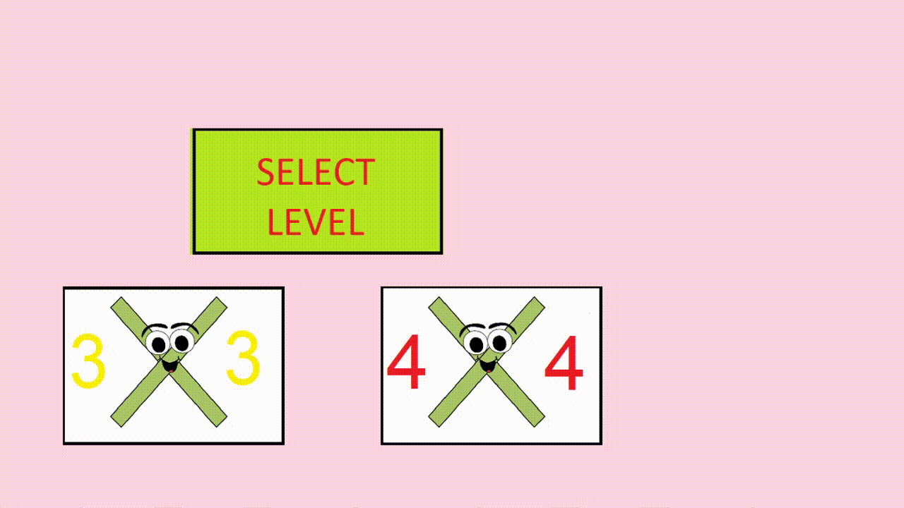

# 2048 Game iGraphics Project

2048 is a single-player sliding block puzzle game designed by Italian web developer Gabriele Cirulli. The objective of the game is to slide numbered tiles on a grid to combine them to create a tile with the number 2048; however, one can continue to play the game after reaching the goal, creating tiles with larger numbers.

Here 2048 Game is written in C programming language with iGraphics library.

